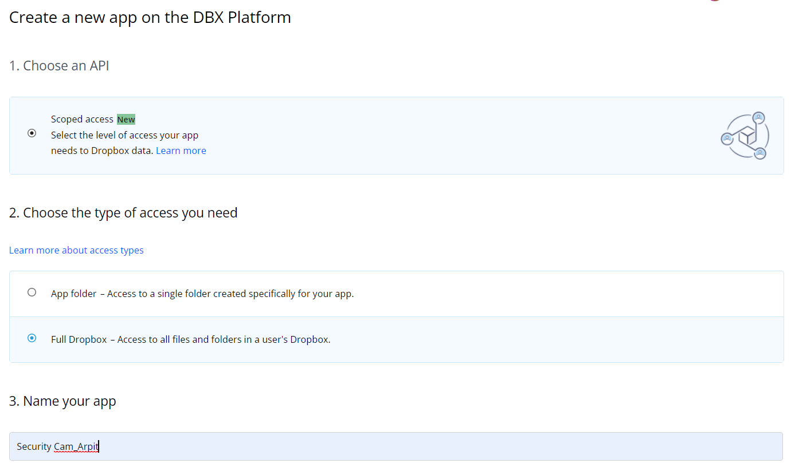

## Security Camera using [Opencv](https://opencv.org) & [Dropbox](https://www.dropbox.com/home)

This is a simple Security Camera created using Opencv in Python where images gets saved in realtime in your Dropbox account at every 5 seconds.

### Dropbox Setup Guide (Get Access Token) - 
 1. Create an account of yours in [Dropbox](https://www.dropbox.com/home).
 2. Go to https://www.dropbox.com/lp/developers
 3. Click on App Console (top right corner) -> Create app (refer the image below for details) -> Create app (bottom right)
 

  
 

 
 4. Get back to [My Apps](https://www.dropbox.com/developers/apps) -> <your_app>
 5. Click on Permissions -> Under Files and folders, check on "files.content.write" box
 6. Click on Settings -> Under OAuth 2 -> Click on Generated access token -> copy the access code and paste it in the [code file](https://github.com/Ar-tech937/Security-Camera/blob/main/security_cam.py)

### References

 - How to create dropbox account - [link](https://help.dropbox.com/accounts-billing/create-delete/create-account)
